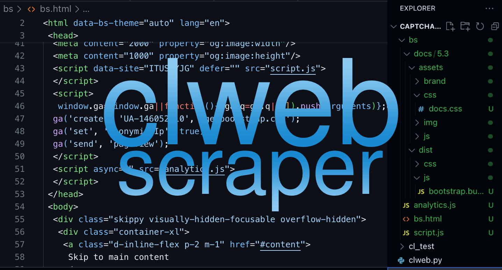

 

# Production Use
This probably has a ton of vulnerabilities so don't use in production!! This should only be standard CLI use.
# Features
- Saving HTML, JS, CSS, and Images.
- Saving the content like images inside css files, etc.
- Creating folders based off the ones in the link.
- Replacing URLs for local-use. (Broken)
- Beautified HTML
- Clean Saving
- User-Agent usage
# Coming Soon
- Fixing replacing urls
- Full scrape of html, so it works locally
- Beautified JS and CSS (needed badly)
# Contributors
- me
- me
- me
# Bugs
- Replacing URLS don't work lmao